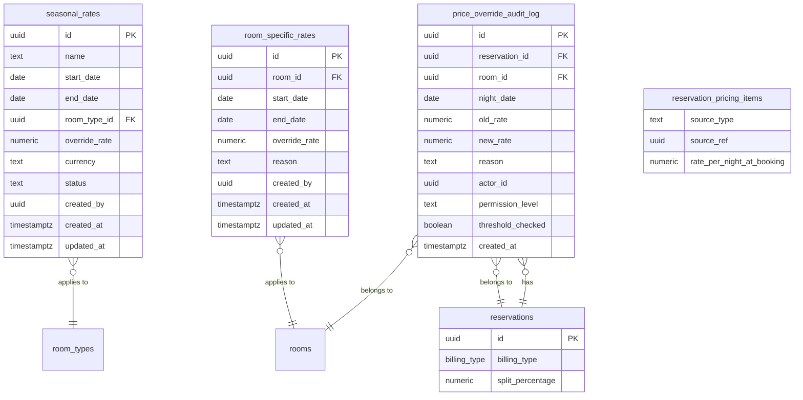

# Data Model: Pricing and Company Billing

**Phase**: 1 — Entity Design | **Date**: 2026-06-28

## Entity-Relationship Diagram



## Tables

### New: `seasonal_rates`

| Column | Type | Constraints | Notes |
|--------|------|-------------|-------|
| id | UUID | PK, DEFAULT gen_random_uuid() | |
| name | TEXT | NOT NULL | e.g., "Summer 2026", "Christmas Peak" |
| start_date | DATE | NOT NULL | Inclusive start |
| end_date | DATE | NOT NULL | Exclusive end — a night N is in-season when `start_date <= N < end_date` |
| room_type_id | UUID | NOT NULL → room_types(id) | Which room type this season applies to |
| override_rate | NUMERIC(10,2) | NOT NULL, CHECK >= 0 | The nightly rate during this season |
| currency | TEXT | NOT NULL, DEFAULT 'USD' | |
| status | TEXT | NOT NULL, DEFAULT 'active', CHECK (active, inactive) | Soft delete / deactivation |
| created_by | UUID | NOT NULL | FK to users table |
| created_at | TIMESTAMPTZ | NOT NULL, DEFAULT now() | |
| updated_at | TIMESTAMPTZ | NOT NULL, DEFAULT now() | |

**Indexes**: `(room_type_id, start_date, end_date)` for efficient lookup by room_type+date. `(status)` for filtering active seasons.

### New: `room_specific_rates`

| Column | Type | Constraints | Notes |
|--------|------|-------------|-------|
| id | UUID | PK, DEFAULT gen_random_uuid() | |
| room_id | UUID | NOT NULL → rooms(id) | |
| start_date | DATE | NOT NULL | Inclusive |
| end_date | DATE | NOT NULL | Exclusive |
| override_rate | NUMERIC(10,2) | NOT NULL, CHECK >= 0 | |
| reason | TEXT | | Optional explanation |
| created_by | UUID | NOT NULL | |
| created_at | TIMESTAMPTZ | NOT NULL, DEFAULT now() | |
| updated_at | TIMESTAMPTZ | NOT NULL, DEFAULT now() | |

**Indexes**: `(room_id, start_date, end_date)`.

### New: `price_override_audit_log`

| Column | Type | Constraints | Notes |
|--------|------|-------------|-------|
| id | UUID | PK, DEFAULT gen_random_uuid() | |
| reservation_id | UUID | NOT NULL → reservations(id) | |
| room_id | UUID | NOT NULL → rooms(id) | |
| night_date | DATE | NOT NULL | Which night was overridden |
| old_rate | NUMERIC(10,2) | NOT NULL | Rate before override |
| new_rate | NUMERIC(10,2) | NOT NULL | Rate after override |
| reason | TEXT | NOT NULL | Required explanation |
| actor_id | UUID | NOT NULL | User who performed override |
| permission_level | TEXT | NOT NULL, CHECK (admin, front_desk) | |
| threshold_checked | BOOLEAN | NOT NULL, DEFAULT false | Was threshold enforced? |
| created_at | TIMESTAMPTZ | NOT NULL, DEFAULT now() | |

**Indexes**: `(reservation_id)` for per-reservation audit trail. `(actor_id)` for per-user history.

### New Type: `billing_type` Enum

```sql
CREATE TYPE billing_type AS ENUM (
  'guest_pays',
  'company_room_only',
  'company_all_charges',
  'split'
);
```

### Extended: `reservations` (new columns)

| Column | Type | Constraints | Notes |
|--------|------|-------------|-------|
| billing_type | billing_type | NOT NULL, DEFAULT 'guest_pays' | |
| split_percentage | NUMERIC(5,2) | CHECK 0-100, DEFAULT NULL | Populated when billing_type = 'split' |

### Extended: `reservation_pricing_items` (new columns)

| Column | Type | Constraints | Notes |
|--------|------|-------------|-------|
| source_type | TEXT | NOT NULL, CHECK (default_rate, seasonal_rate, room_specific_rate, company_override, manual_override) | |
| source_ref | UUID | | FK to the source row (nullable for default_rate) |
| rate_per_night_at_booking | NUMERIC(10,2) | | Snapshot of the resolved rate at booking time |

## Pricing Ladder State Machine

```
Rate Lookup (per room per night):
  1. manual_override exists?        → manual_override.rate  [source_ref → price_override_audit_log.id]
  2. company_override exists?       → company_override.rate  [source_ref → company_price_overrides.id]
  3. seasonal_rate exists?          → seasonal_rate.rate     [source_ref → seasonal_rates.id]
  4. room_specific_rate exists?     → room_specific_rate.rate [source_ref → room_specific_rates.id]
  5. fallback                       → room_types.default_rate [source_ref → NULL]
```

## Recalculation Triggers

For **draft** reservations only, pricing is recalculated when:
- Check-in or check-out date changes → all nightly items recomputed
- Room or room type changes → affected nights recomputed
- Company changes → company_override rate may change
- Billing type changes → distribution changes (not the rate itself)
- Seasonal rates, room-specific rates, company overrides change → individual rate sources may shift

For **confirmed** reservations: `reservation_pricing_items` is the authoritative source. Manual overrides are the only mechanism to adjust post-confirmation pricing (FR-011 — flagged for review on date/room changes).
