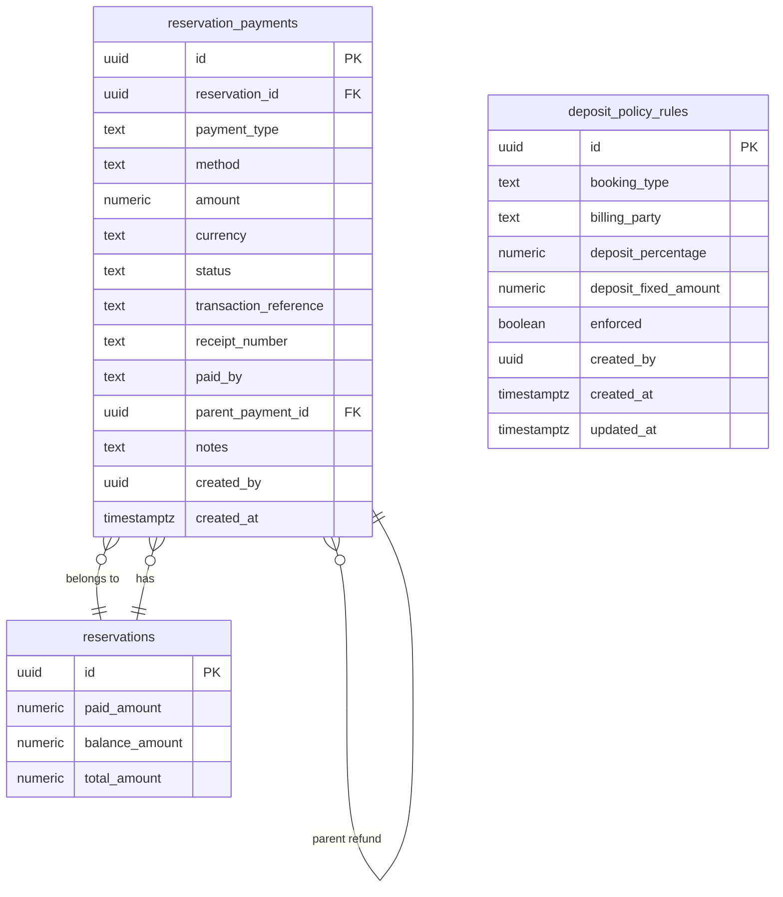

# Data Model: Payments and Balance

**Phase**: 1 — Entity Design | **Date**: 2026-06-28

## Entity-Relationship Diagram



## Tables

### New: `reservation_payments`

| Column | Type | Constraints | Notes |
|--------|------|-------------|-------|
| id | UUID | PK, DEFAULT gen_random_uuid() | |
| reservation_id | UUID | NOT NULL → reservations(id) ON DELETE CASCADE | |
| payment_type | TEXT | NOT NULL, CHECK (deposit, partial_payment, full_payment, refund, company_invoice, guarantee_only) | |
| method | TEXT | NOT NULL, CHECK (cash, card, bank_transfer, company_credit, voucher, other) | |
| amount | NUMERIC(12,2) | NOT NULL, CHECK > 0 | Always positive — refunds use parent_payment_id |
| currency | TEXT | NOT NULL, DEFAULT 'USD' | |
| status | TEXT | NOT NULL, DEFAULT 'pending', CHECK (pending, paid, failed, refunded) | |
| transaction_reference | TEXT | | Receipt/transaction ID from external system |
| receipt_number | TEXT | | Internal receipt number |
| paid_by | TEXT | NOT NULL, DEFAULT 'guest', CHECK (guest, company, split) | |
| parent_payment_id | UUID | → reservation_payments(id) | Self-ref for refunds |
| notes | TEXT | | Free-text |
| created_by | UUID | NOT NULL | |
| created_at | TIMESTAMPTZ | NOT NULL, DEFAULT now() | |

**Indexes**: `(reservation_id)` for per-reservation queries, `(parent_payment_id)` for refund lookups, `(status)` for filtering.

### New: `deposit_policy_rules`

| Column | Type | Constraints | Notes |
|--------|------|-------------|-------|
| id | UUID | PK, DEFAULT gen_random_uuid() | |
| booking_type | TEXT | NOT NULL | e.g., individual, company, group |
| billing_party | TEXT | | NULL = applies to all, otherwise filters by billing party |
| deposit_percentage | NUMERIC(5,2) | | e.g., 20.00 = 20% of total |
| deposit_fixed_amount | NUMERIC(12,2) | | e.g., 100.00 flat deposit |
| enforced | BOOLEAN | NOT NULL, DEFAULT true | true = blocks check-in, false = warns only |
| created_by | UUID | NOT NULL | |
| created_at | TIMESTAMPTZ | NOT NULL, DEFAULT now() | |
| updated_at | TIMESTAMPTZ | NOT NULL, DEFAULT now() | |

**Check**: At least one of deposit_percentage or deposit_fixed_amount must be non-null.

## Payment Status State Machine

```
                     ┌─────────┐
                     │ pending │  (initial — guarantee_only, company_invoice)
                     └────┬────┘
                          │
              ┌───────────┼───────────┐
              ▼           ▼           ▼
          ┌───────┐  ┌────────┐  ┌────────┐
          │ paid  │  │ failed │  │ refund │ (terminal — money collected)
          └───┬───┘  └────────┘  └────────┘
              │
              ▼
        ┌──────────┐
        │ refunded │  (only for refund entries referencing parent 'paid')
        └──────────┘
```

## Balance Update Rules

- `record_payment()`: `paid_amount += amount`, `balance_amount = total_amount - paid_amount`
- `record_refund()`: `paid_amount -= refund_amount`, `balance_amount = total_amount - paid_amount`
- `guarantee_only` / `company_invoice`: No change to paid_amount or balance_amount
- Overpayment block: Reject if `paid_amount + amount > total_amount` unless overpayment permission flag
